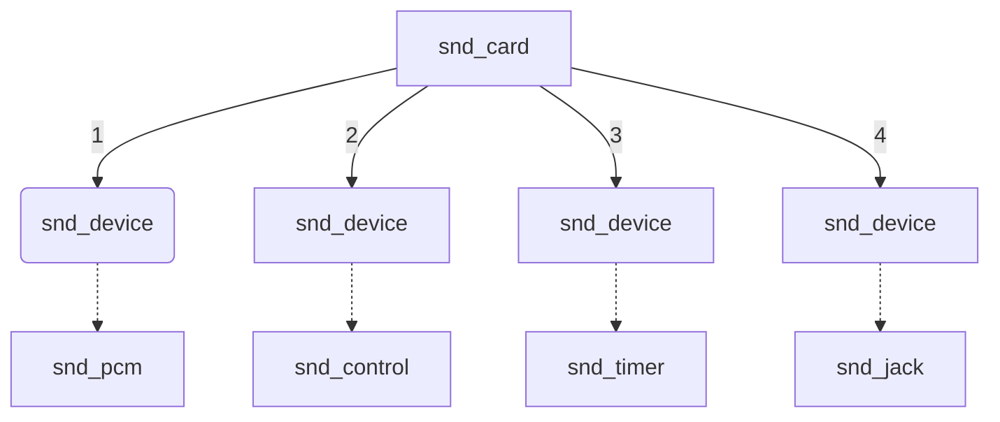

```mermaid
graph TD
A[snd_card] --> |1|B(snd_device)
B -.->B1[snd_pcm]
A --> |2| C[snd_device]
C -.-> C1[snd_control]
A --> |3| D[snd_device]
D -.-> D1[snd_timer]
A --> |4| E[snd_device]
E -.-> E1[snd_jack]

```